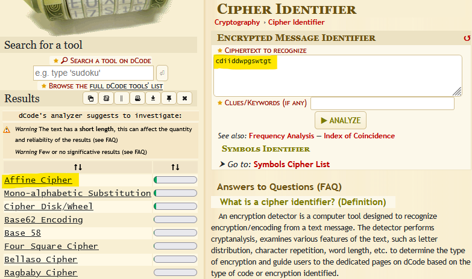
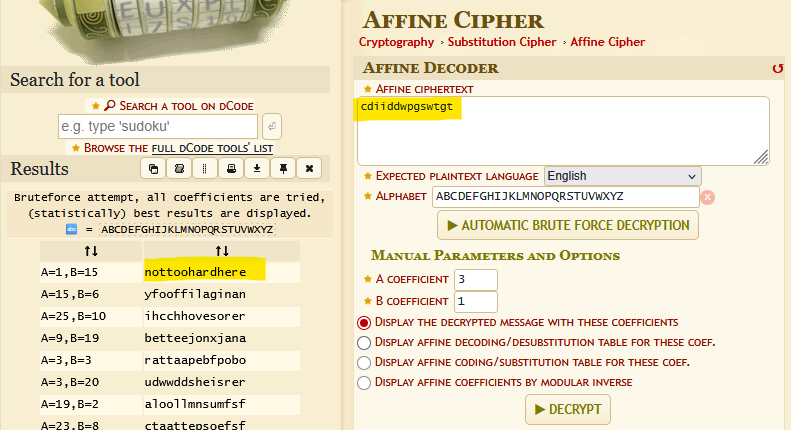

# Level00

## Solution

Check if the target user has files

```
$ find / -user flag00 2>/dev/null
/usr/sbin/john
/rofs/usr/sbin/john
```

We can see that he has two files.

```
$ cat /usr/sbin/john
cdiiddwpgswtgt

$ cat /rofs/usr/sbin/john
cdiiddwpgswtgt
```

The two files contain the same code.
Let's try it.

```
$ su flag00
Password: cdiiddwpgswtgt
su: Authentication failure
```

Maybe it's encrypted.
Let's try to decrypt it.
</br>
We will use <<https://www.dcode.fr>>.



Apparently, the code uses the Affine Cipher.



According to the decryptor, the code would be ``nottoohardhere``. Let's try it.

```
$ su flag00
Password: nottoohardhere
Don't forget to launch getflag !
$ getflag
Check flag.Here is your token : x24ti5gi3x0ol2eh4esiuxias
```